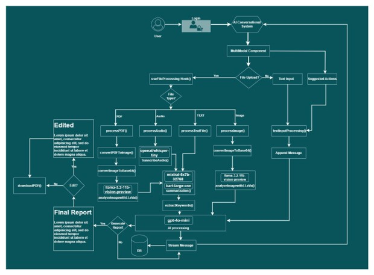
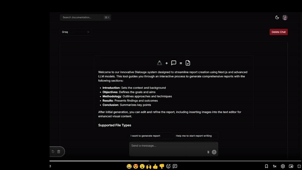

# Next.js AI Chatbot

A production-ready AI chatbot application built with Next.js 14, Vercel AI SDK, and multiple AI providers. Create intelligent conversations and generate structured documents with multimedia support. I have build this during my thesis
work.

## Table of Contents

- [Next.js AI Chatbot](#nextjs-ai-chatbot)
  - [Table of Contents](#table-of-contents)
  - [Features](#features)
    - [Core Capabilities](#core-capabilities)
    - [Technical Features](#technical-features)
  - [Tech Stack](#tech-stack)
  - [AI Models](#ai-models)
  - [Getting Started](#getting-started)
    - [Prerequisites](#prerequisites)
    - [Installation](#installation)
  - [Project Architecture](#project-architecture)
  - [Project Demo](#project-demo)
  - [Project Structure](#project-structure)
    - [Chat Endpoints](#chat-endpoints)
      - [`POST /api/chat`](#post-apichat)
  - [Deployment](#deployment)
    - [Deploy to Vercel (Recommended)](#deploy-to-vercel-recommended)
    - [Manual Deployment](#manual-deployment)
  - [Contributing](#contributing)
  - [License](#license)
  - [Acknowledgments](#acknowledgments)
  - [Support](#support)

## Features

### Core Capabilities

- **Multi-Model AI Support** - OpenAI, Anthropic, Cohere, Hugging Face, GROQ and others
- **Streaming Chat Interface** - Real-time AI responses with Vercel AI SDK
- **Document Generation** - Create structured reports from conversations
- **Multimedia Support** - Handle images, audio, and file uploads
- **Chat History** - Persistent conversation storage with Vercel KV or Postgres (Not in this version )
- **Authentication** - Secure access via NextAuth.js or Clerk (Not in this version)
- **Rate Limiting** - API protection and usage controls

### Technical Features

- Next.js 14 App Router with React Server Components
- Server Actions for optimized data fetching
- Suspense boundaries for better UX
- Modern UI with shadcn/ui + Tailwind CSS
- Type-safe with TypeScript
- Responsive design for all devices

## Tech Stack

| Layer              | Technologies                       |
| ------------------ | ---------------------------------- |
| **Frontend**       | Next.js 14, React 18, TypeScript   |
| **Styling**        | Tailwind CSS, shadcn/ui, Radix UI  |
| **AI Integration** | Vercel AI SDK, OpenAI, GROQ        |
| **Backend**        | Next.js API Routes, Server Actions |
| **Auth**           | NextAuth.js / Clerk                |
| **Deployment**     | Vercel                             |

## AI Models

The application supports multiple AI models optimized for different tasks:

| Task              | Model                                     | Provider     | Purpose                  |
| ----------------- | ----------------------------------------- | ------------ | ------------------------ |
| **Chat**          | GPT-4 Mini                                | OpenAI       | Main conversational AI   |
| **Image**         | meta-llama/llama-4-scout-17b-16e-instruct | GROQ         | Image process            |
| **Summarization** | BART Large CNN / Qwen 3 32B               | Hugging Face | Document summarization   |
| **Transcription** | Whisper Large v3                          | OpenAI       | Audio-to-text conversion |

## Getting Started

### Prerequisites

- Node.js 18+ or Bun
- npm, pnpm, or yarn
- OpenAI API key (required)
- Optional: GROQ, Hugging Face API keys

### Installation

1. **Clone the repository**

```bash
git clone https://github.com/MarufRayhan/llm-chat-doc-generation.git
cd ai-chatbot
```

2. **Install dependencies**

```bash
npm install
# or
pnpm install
# or
yarn install
```

3. **Set up environment variables**

Create a `.env.local` file in the root directory:

```bash
# Required
OPENAI_API_KEY=sk-...
NEXT_PUBLIC_GROQ_API_KEY=gsk_...
HUGGINGFACE_OPENAI_API_KEY=hf_...
HUGGINGFACE_API_KEY=hf_...


# Optional - Chat History (Vercel KV)
KV_URL=
KV_REST_API_URL=
KV_REST_API_TOKEN=
KV_REST_API_READ_ONLY_TOKEN=
AUTH_SECRET=


# Optional - Alternative AI Providers
ANTHROPIC_API_KEY=

# Optional - Authentication
NEXTAUTH_URL=http://localhost:3000
```

4. **Run the development server**

```bash
npm install
npm run dev
```

Open [http://localhost:3000](http://localhost:3000) in your browser.

## Project Architecture

Note some models are depreciated so new models are replaced, but the architecture is same.



## Project Demo



## Project Structure

```
ai-chatbot/
│
├── app/                        # Next.js App Router
│   ├── api/                    # API endpoints
│   │   ├── chat/              # Main chat API
│   │   └── transcribe-audio/  # Audio transcription
│   ├── chat/                   # Chat pages
│   │   ├── page.tsx           # Chat list/new chat
│   │   └── [id]/             # Individual chat view
│   ├── actions.ts             # Server actions
│   ├── layout.tsx             # Root layout
│   ├── page.tsx               # Landing page
│   └── globals.css            # Global styles
│
├── components/                 # React components
│   ├── chat/                  # Chat-specific components
│   │   ├── message.tsx        # Message display
│   │   ├── multimodal-input.tsx # Input with file upload
│   │   ├── overview.tsx       # Chat overview
│   │   └── hooks/            # Chat hooks
│   ├── ui/                    # shadcn/ui components
│   ├── header.tsx            # App header
│   ├── providers.tsx         # Context providers
│   └── theme-toggle.tsx      # Dark mode toggle
│
├── lib/                       # Utilities and helpers
│   ├── chat/                 # Chat logic
│   ├── hooks/                # Custom hooks
│   ├── types.ts              # Type definitions
│   └── utils.ts              # Helper functions
│
├── hooks/                     # Global hooks
├── actions/                   # Server actions
├── auth.config.ts            # Auth configuration
├── auth.ts                   # Auth implementation
├── middleware.ts             # Next.js middleware
│
├── public/                   # Static assets
├── types/                    # Global type definitions
│
├── tailwind.config.ts       # Tailwind configuration
├── tsconfig.json            # TypeScript configuration
├── components.json          # shadcn/ui config
└── package.json             # Dependencies
```

### Chat Endpoints

#### `POST /api/chat`

Main chat endpoint for AI interactions.

**Request Body:**

```json
{
  "messages": [
    {
      "role": "user",
      "content": "Your message"
    }
  ]
}
```

**Response:** Streaming AI response

## Deployment

### Deploy to Vercel (Recommended)

[](https://vercel.com/new/clone)

1. Click the deploy button above
2. Connect your GitHub repository
3. Configure environment variables in Vercel dashboard
4. Deploy!

### Manual Deployment

```bash
# Install Vercel CLI
npm i -g vercel

# Login to Vercel
vercel login

# Deploy
vercel

# Deploy to production
vercel --prod
```

## Contributing

Contributions are welcome! Please follow these steps:

1. Fork the repository
2. Create a feature branch (`git checkout -b feature/amazing-feature`)
3. Commit your changes (`git commit -m 'Add amazing feature'`)
4. Push to the branch (`git push origin feature/amazing-feature`)
5. Open a Pull Request

## License

This project is licensed under the MIT License - see the [LICENSE](LICENSE) file for details.

## Acknowledgments

- [Vercel](https://vercel.com) - Hosting and AI SDK
- [OpenAI](https://openai.com) - GPT models
- [Groq](https://groq.com) - Groq models
- [Huggingface](https://huggingface.com) - Huggingface models
- [shadcn/ui](https://ui.shadcn.com) - UI components
- [Next.js](https://nextjs.org) - React framework

## Support

- Email: maruf.rayhan14@gmail.com
- Website: www.marufrayhan.com

```

```
